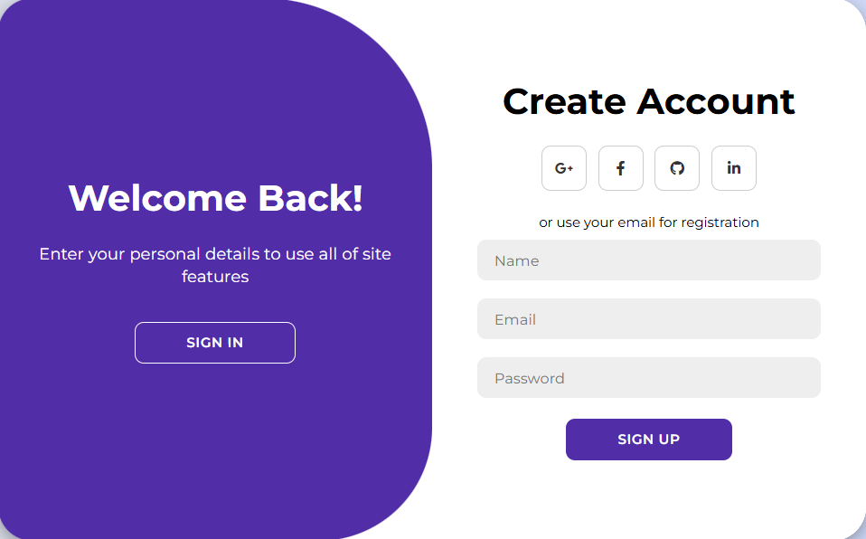

# 🌟 Login & Sign-Up Page

A sleek and responsive **Login & Sign-Up page** built with **HTML, CSS, and JavaScript**, featuring social login buttons and smooth form toggling animations. Perfect as a front-end template for web projects.  



---

## 🚀 Features

- **Sign In / Sign Up Forms** with smooth toggle animations  
- **Social Login Buttons**: Google, Facebook, GitHub, LinkedIn  
- **Responsive Design** that works on mobile, tablet, and desktop  
- **Modern UI/UX** with clear form inputs and hover effects  

---

## 🛠️ Technologies Used

- **HTML5**  
- **CSS3** (Flexbox & modern styling)  
- **JavaScript** (form toggle functionality)  
- **Font Awesome** (social icons)

---

## ⚡ Live Demo

You can see it live via GitHub Pages:  
[https://alirezahkim.github.io/login-page/](https://alirezahkim.github.io/login-page/)  


---

## 📂 Installation

1. Clone the repository:  
```bash
git clone https://github.com/alirezahkim/login-page.git

## 📄 License

This project is licensed under the [MIT License](LICENSE) – see the LICENSE file for details.

